Выполнила студентка ИКБО-30-24
Вариант 6

# Этап 1: Минимальный прототип с конфигурацией

### Общее описание
Данный проект представляет собой прототип CLI-приложения для анализа зависимостей Python-пакетов.  
Целью первого этапа является создание минимально работоспособной версии, принимающей параметры конфигурации из командной строки и выполняющей их базовую проверку.  

Программа служит основой для следующих этапов, где будет реализован сбор данных о зависимостях и их визуализация в виде графа.  
На текущем этапе приложение не выполняет реальный анализ пакетов, а только проверяет корректность переданных аргументов и отображает их в формате *ключ–значение*.

---

### Функции и настройки

#### **Основные функции:**
**1. CLI-интерфейс:**  
Программа запускается через терминал и принимает параметры конфигурации через аргументы командной строки.

**2. Настраиваемые параметры:**
- `--package-name` — имя анализируемого пакета.  
- `--repository-url` — URL-адрес или путь к локальному репозиторию.  
- `--test-repo-mode` — режим работы с тестовым репозиторием (`local` или `remote`).  
- `--package-version` — версия пакета.  
- `--output-file` — имя выходного файла для графа зависимостей (например, `graph.png`).

**3. Проверка корректности:**  
Программа выполняет валидацию введённых данных:
- проверяет наличие указанного файла или директории, если используется локальный путь;
- контролирует корректность расширения выходного файла (`.png`, `.jpg`, `.svg`);
- проверяет формат версии пакета (наличие числовых символов).

**4. Обработка ошибок:**  
При некорректных параметрах приложение выводит сообщение об ошибке и завершает работу с ненулевым кодом выхода.

**5. Вывод параметров:**  
После успешного запуска приложение выводит все переданные параметры в формате *ключ–значение*.

---

**Запуск**

*Без ошибок*
```bash
python st1.py \
  --package-name numpy \
  --repository-url https://pypi.org/ \
  --test-repo-mode remote \
  --package-version 2.29.0 \
  --output-file graph.png
```
**Вывод**

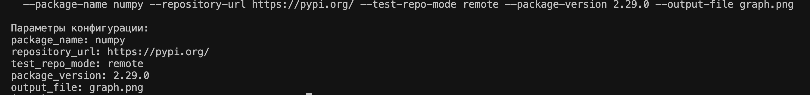

*Без значения*
```bash
python st1.py \
  --package-name numpy \
  --repository-url https://pypi.org/ \
  --test-repo-mode remote \
  --package-version 2.29.0 \
  --output-file 
```
**Вывод**

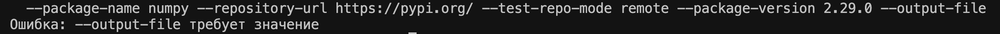
*Без параметра*
```bash
python st1.py \
  --package-name numpy \
  --repository-url https://pypi.org/ \
  --test-repo-mode remote \
  --package-version 2.29.0 \
```
**Вывод**


# Этап 2: Сбор данных

## Общее описание
Данный проект представляет собой CLI-приложение для анализа прямых зависимостей Python-пакетов.  
Целью второго этапа является **извлечение информации о прямых зависимостях заданного пакета указанной версии** через официальный репозиторий PyPI.  

На этом этапе приложение не строит дерево всех зависимостей и не выполняет визуализацию — оно **только получает и отображает прямые зависимости**, что является основой для последующего анализа и визуализации.

---

## Функции и настройки

### Основные функции:
**1. CLI-интерфейс:**  
Программа запускается через терминал и принимает параметры конфигурации через аргументы командной строки.

**2. Настраиваемые параметры:**
- `--package-name` — имя анализируемого пакета.  
- `--repository-url` — URL официального репозитория PyPI.  
- `--test-repo-mode` — режим работы с репозиторием (`local` или `remote`).  
- `--package-version` — версия пакета, для которой извлекаются зависимости.  
- `--output-file` — имя выходного файла для скачиваемого пакета (`.tar.gz` или `.whl`).

**3. Проверка корректности:**  
Программа выполняет валидацию введённых данных:
- проверяет корректность URL репозитория (только официальный PyPI);
- контролирует расширение выходного файла (`.tar.gz` или `.whl`);
- проверяет формат версии пакета (наличие цифр);
- проверяет режим работы с репозиторием (`local` или `remote`).

**4. Получение зависимостей:**  
Программа формирует URL API PyPI в формате:
https://pypi.org/{package_name}/{package_version}/json
и загружает JSON с метаданными пакета.  

**5. Обработка ошибок:**  
При некорректных параметрах или проблемах с доступом к репозиторию программа выводит сообщение об ошибке и завершает работу с ненулевым кодом выхода.

---

## Примеры запуска

**Пример для пакета `pandas` версии 2.2.2:**
```bash
python st2.py --package-name pandas --repository-url https://pypi.org --test-repo-mode remote --package-version 2.2.2 --output-file pandas-2.2.2.whl
```
**Вывод**

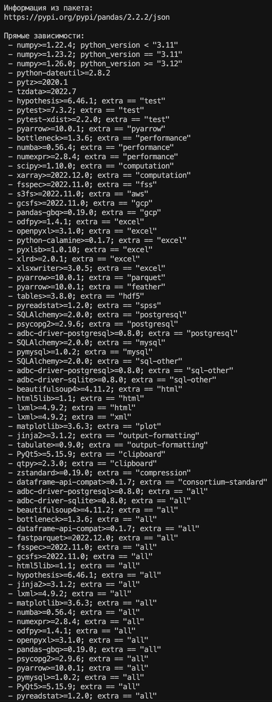

**Пример для пакета `flask` версии 3.0.3:**
```bash
python st2.py --package-name flask --repository-url https://pypi.org --test-repo-mode remote --package-version 3.0.3 --output-file flask-3.0.3.whl
```
**Вывод**

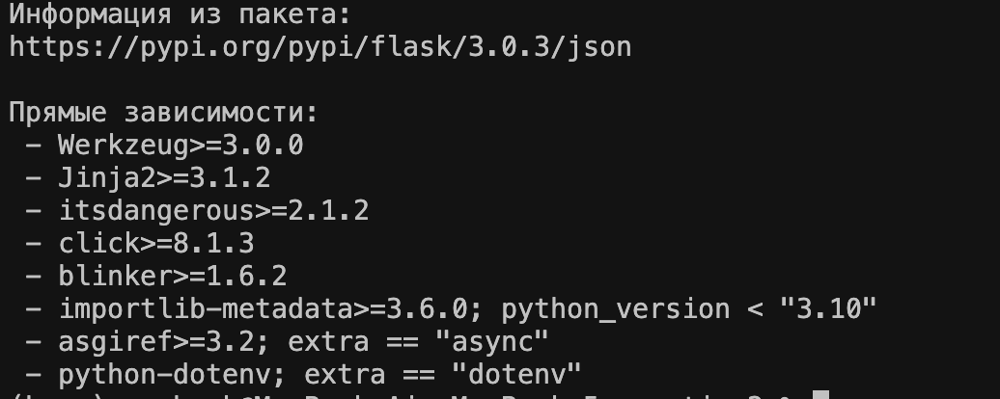
**Пример для пакета `django` версии 5.1.2:**
```bash
python st2.py --package-name django --repository-url https://pypi.org --test-repo-mode remote --package-version 5.1.2 --output-file django-5.1.2.whl
```
**Вывод**

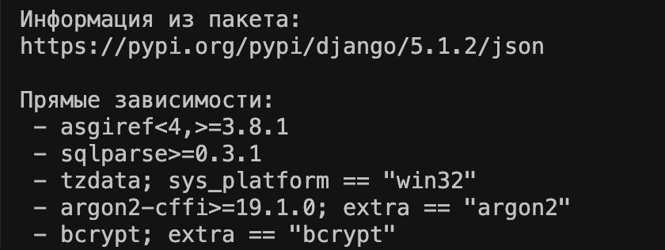
**Пример для пакета `numPy` версии 1.26.1:**
```bash
python st2.py --package-name numpy --repository-url https://pypi.org --test-repo-mode remote --package-version 1.26.1 --output-file numpy-1.26.1.whl
```
**Вывод**

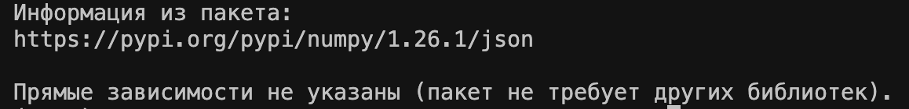
# Этап 3: Основные операции

## Общее описание
Данный проект представляет собой CLI-приложение для анализа **графа зависимостей Python-пакетов**.  
Цель этапа 3 — построение графа зависимостей с учётом **транзитивности**, обработка **циклов** и поддержка **тестового локального репозитория**.  

Особенности:
- DFS без рекурсии для поиска всех зависимостей  
- Корректная обработка циклов  
- Возможность работы как с реальными пакетами PyPI (`remote`), так и с локальными тестовыми файлами (`local`)  

---

## Аргументы CLI

- `--package-name` — имя анализируемого пакета  
- `--repository-url` — URL PyPI или путь к локальному файлу с графом  
- `--test-repo-mode` — `local` или `remote`  
- `--package-version` — версия пакета (для remote)  
- `--output-file` — имя выходного файла (`.whl` или `.tar.gz`)

---

## Принцип работы

1. **Загрузка графа зависимостей**:
   - `remote`: получает JSON с PyPI и извлекает прямые зависимости  

   - `local`: читает файл формата:
     ```
     A: B C
     B: D
     C: D E
     D:
     E:
     ```
      первая колонка — пакет, после двоеточия — его прямые зависимости

2. **DFS без рекурсии**:
   - Используется стек и множество `visited`, чтобы обходить граф без рекурсий  
   - Множество `result` хранит все транзитивные зависимости  
   - Циклы безопасно обрабатываются (не застреваем в бесконечном цикле)

---

## Локальные тестовые файлы

#### 1. `test1.txt` — простой граф
```
A: B C
B: D
C: D E
D:
E:
```
### Запуск
```bash
python st3.py --package-name A --repository-url test1.txt --test-repo-mode local --package-version 1.0.0 --output-file test1.whl
```
**Вывод**

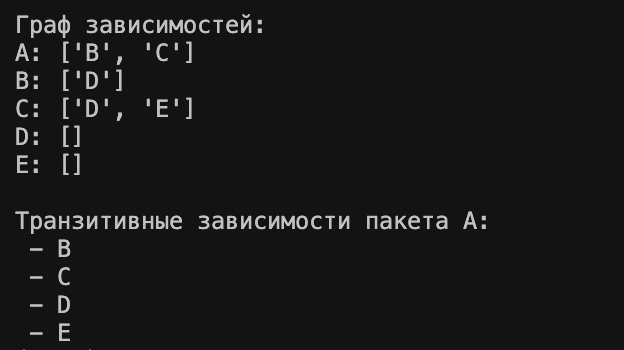
#### 2. `test2.txt` — граф с циклом
```
X: Y Z
Y: Z X
Z: W
W:
```
### Запуск
```bash
python st3.py --package-name X --repository-url test2.txt --test-repo-mode local --package-version 1.0.0 --output-file test2.whl
```
**Вывод**

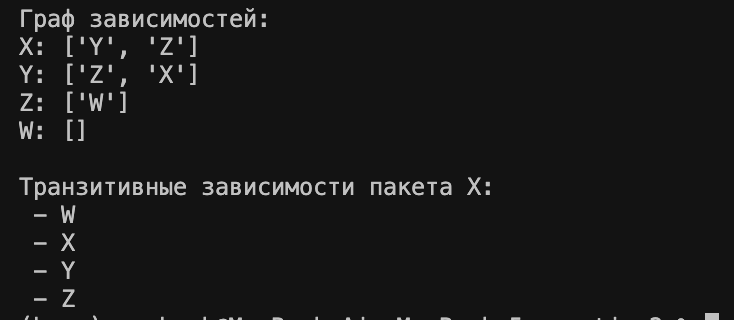
#### 3. `test3.txt` — сложный граф с несколькими циклами
```
P: Q R
Q: R S
R: P T
S: T
T:
```
### Запуск
```bash
python st3.py --package-name P --repository-url test3.txt --test-repo-mode local --package-version 1.0.0 --output-file test3.whl
```
**Вывод**

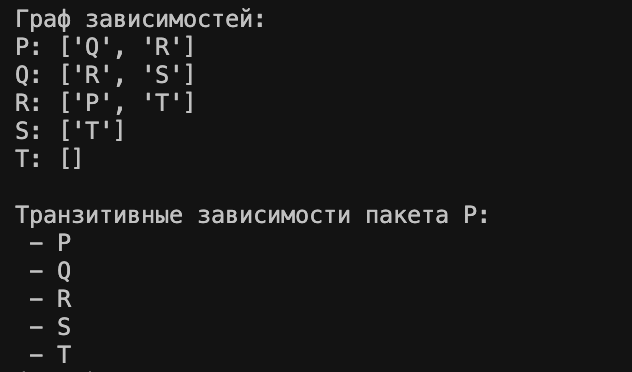
## Примеры удаленного запуска
### 1
```bash
python st3.py --package-name flask --repository-url https://pypi.org --test-repo-mode remote --package-version 3.0.3 --output-file flask-3.0.3.whl
```
**Вывод**

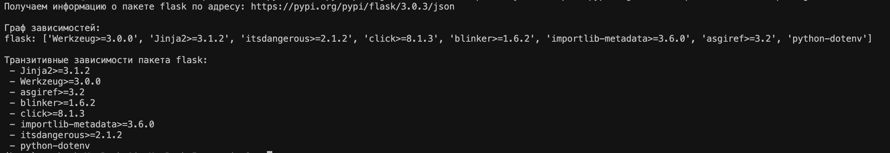
### 2
```bash
python st3.py --package-name pandas --repository-url https://pypi.org --test-repo-mode remote --package-version 2.2.2 --output-file pandas-2.2.2.whl
```
**Вывод**

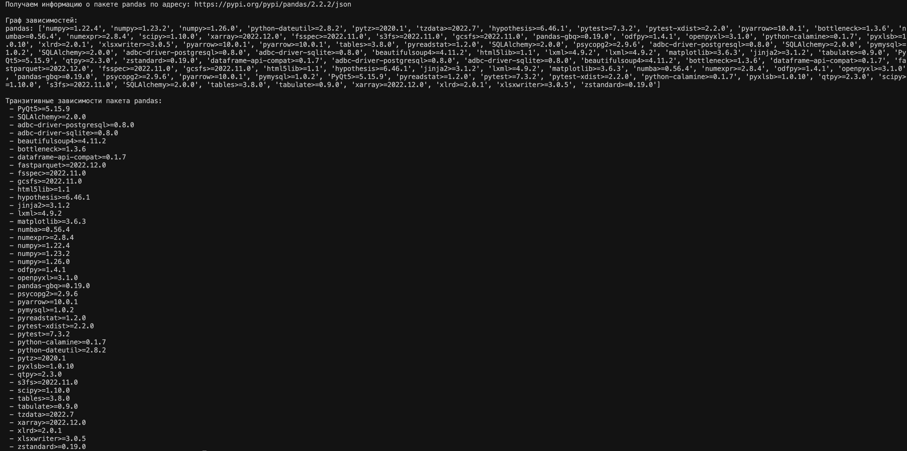
### 3
```bash
python st3.py --package-name fastapi --repository-url https://pypi.org --test-repo-mode remote --package-version 0.115.0 --output-file fastapi-0.115.0.whl
```
**Вывод**

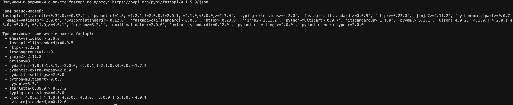
# Этап 4: Дополнительные операции

### Общее описание
На этом этапе в CLI-приложении добавлена поддержка **режима вывода обратных зависимостей**.  
Обратные зависимости — это пакеты, **которые зависят от указанного пакета**.  
Например, если `A` зависит от `B`, то `B` имеет обратную зависимость — `A`.

Целью этапа является расширение функциональности программы, реализованной ранее, без изменения структуры данных или логики анализа.

---

### Новые возможности

#### **1. Поддержка обратных зависимостей**
Добавлен новый булевый параметр командной строки:`--reverse-mode` 

Если этот флаг активен, программа:
- строит обратный граф зависимостей (инвертирует связи);
-	применяет тот же алгоритм обхода в глубину (DFS) без рекурсии, что и в Этапе 3;
-	выводит все пакеты, которые зависят от указанного (прямо или транзитивно).

От параметра зависит какой будет вывод, прямая зависимость или обратная
#### **2. Использование существующих тестовых графов**
Для проверки работы обратных зависимостей можно использовать те же локальные тестовые файлы, созданные на Этапе 3.
Это обеспечивает единообразие и позволяет легко проверить корректность обоих режимов работы.
### Запуск для нахождения в обратной зависимости
```bash
python st4.py --package-name D --repository-url test1.txt --test-repo-mode local --package-version 1.0.0 --output-file dummy.whl --reverse-mode true
```
**Вывод**

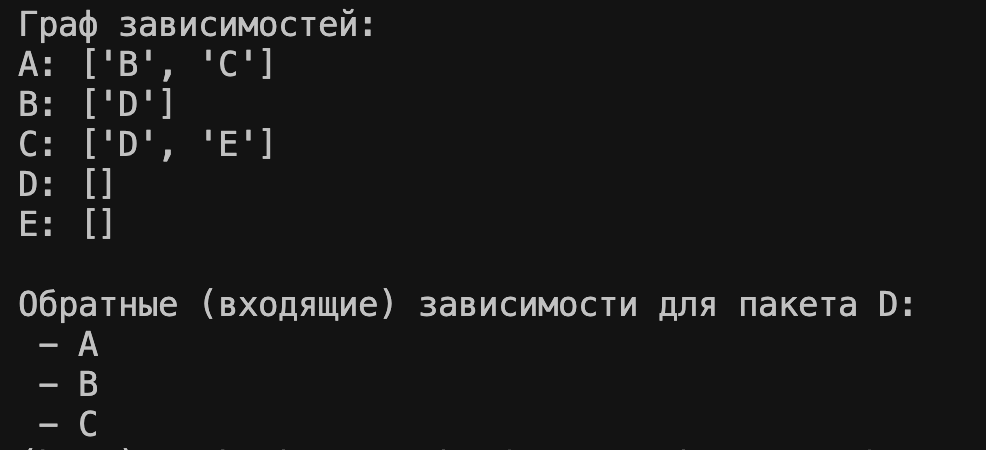

# Этап 5: Визуализация

### Общее описание
На заключительном этапе проекта добавлена **визуализация графа зависимостей** Python-пакетов.  
Теперь пользователь может видеть граф зависимостей в наглядном виде с помощью **Mermaid** и сохранять изображение в формате **SVG**.

Проект продолжает работу предыдущих этапов: загрузка графа, транзитивные зависимости, обратные зависимости.

---

### Новые возможности

#### 1. Генерация графа Mermaid
- Используется словарь зависимостей `graph = {package: [deps]}`.
- Для каждого пакета и его зависимостей формируется текст в формате:
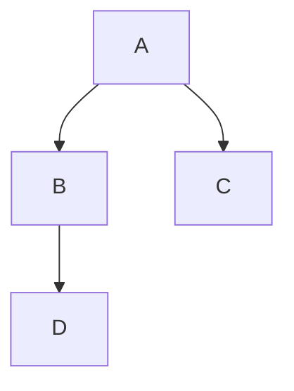
- Функция generate_mermaid(graph) создаёт этот текст
#### 2. Сохранение файлов
- .mmd — текстовое представление графа.
-	.svg — визуализация графа (через Mermaid CLI mmdc).
-	Файлы сохраняются с именем, указанным в --output-file.

#### 3. Новый параметр
-	Булевая функция --visualize — генерация .mmd и .svg.
#### 4. Тестовый запуск
```bash
python st5.py --package-name D --repository-url test1.txt --test-repo-mode local --package-version 1.0.0 --output-file graph.svg --reverse-mode true --visualize true 
```
**Вывод**

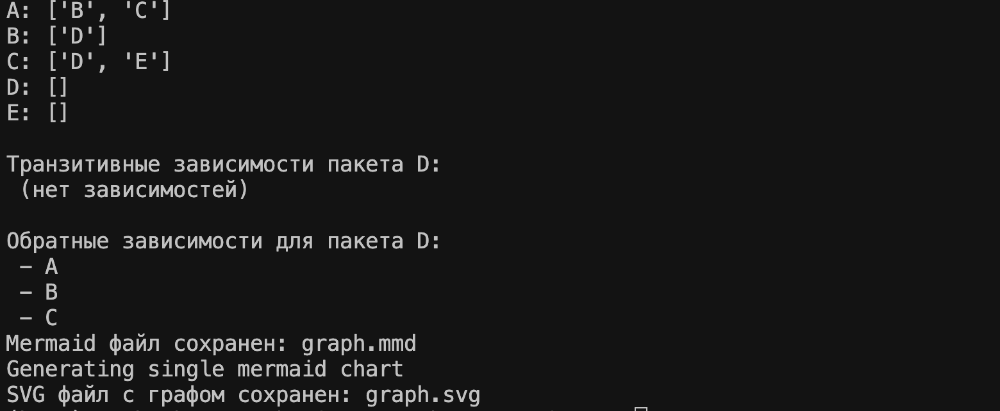

*А также создание файлов:*

**Содержимое файла graph.mmd:**
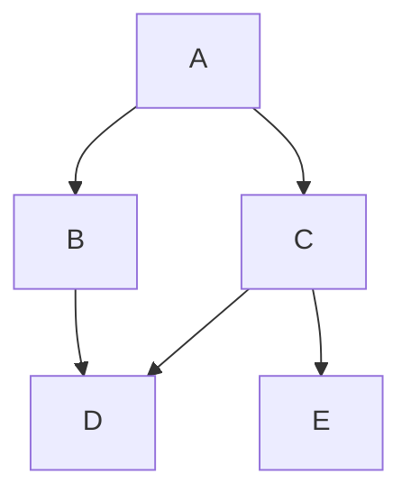
**Содержимое файла graph.svg:**


# Общий вывод по работе
В рамках проекта было разработано CLI-приложение для анализа зависимостей Python-пакетов. На начальном этапе был создан базовый прототип, который принимал параметры пакета через командную строку и проверял их на корректность.

Затем была реализована логика работы с графом зависимостей. Программа извлекает прямые и транзитивные зависимости, правильно обрабатывает циклические зависимости и поддерживает обратные связи для заданного пакета.

На завершающем этапе была добавлена визуализация графа с использованием Mermaid и возможность сохранения изображения в формате SVG. Приложение предоставляет возможность наглядного анализа зависимостей, сравнения результатов с штатными инструментами и объяснения возможных расхождений.

В итоге было создано функциональное, наглядное и удобное средство для анализа зависимостей Python-пакетов, не требующее использования сторонних менеджеров.